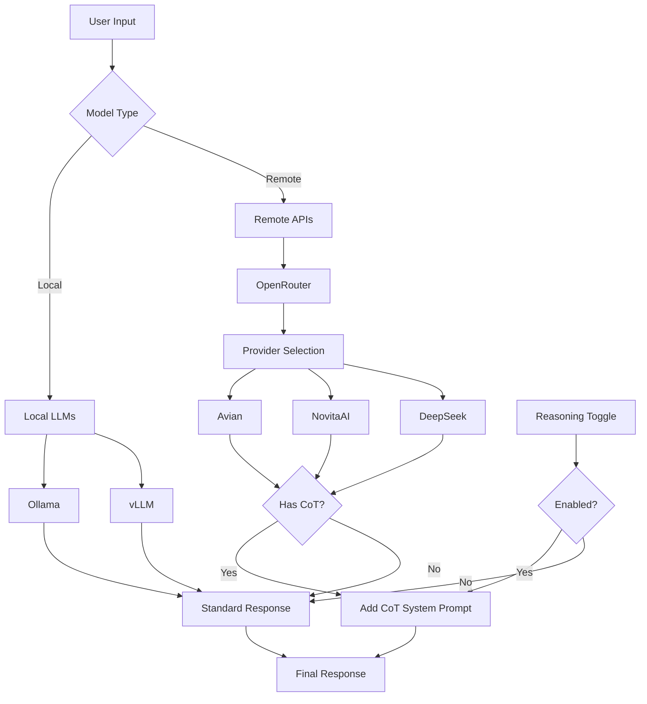

# Local LLM Experiment with Chain of Thought

This project aims to explore and compare local LLM deployments with cloud providers, with a special focus on extracting reasoning and Chain of Thought (CoT) capabilities from DeepSeek models. The main goal is to understand how different deployment methods affect the model's ability to provide step-by-step reasoning.

## Architecture



## Why This Project?

1. **Local vs Cloud Comparison**: Explore the trade-offs between running models locally and using cloud APIs
2. **Reasoning Extraction**: While local models are fast, extracting structured reasoning (Chain of Thought) is challenging
3. **Provider Comparison**: Test the same model (DeepSeek) across different providers to compare performance and capabilities

## Features

- Multi-backend support (Ollama, vLLM, OpenRouter)
- Chain of Thought reasoning toggle
- Streaming responses for faster interaction
- Provider routing through OpenRouter
- CTRL+C handling for graceful exits
- Organized model selection menu

## Prerequisites

### Local Dependencies

1. **Ollama** (for local model deployment)
   ```bash
   # macOS
   brew install ollama
   
   # Linux
   curl -fsSL https://ollama.com/install.sh | sh
   ```

2. **vLLM** (for optimized local inference)
   ```bash
   # Base installation
   pip install vllm
   
   # For Apple Silicon Macs
   # Note: Currently runs on CPU as MPS support is limited
   ```

### API Keys

1. Create a `.env` file in the project root:
   ```env
   OPENROUTER_API_KEY=your_key_here
   GITHUB_REPO_URL=https://github.com/yourusername/local-llm-deepseek
   ```

## Installation

1. Clone the repository:
   ```bash
   git clone https://github.com/padak/local_llm_experiment.git
   cd local_llm_experiment
   ```

2. Create and activate a virtual environment:
   ```bash
   python -m venv venv
   source venv/bin/activate  # On Windows: venv\Scripts\activate
   ```

3. Install dependencies:
   ```bash
   pip install -r requirements.txt
   ```

## Usage

1. Start Ollama (if using local models):
   ```bash
   ollama serve
   ```

2. Pull required models:
   ```bash
   ollama pull deepseek-r1:1.5b
   ollama pull deepseek-r1:7b
   ollama pull mistral:7b
   ```

3. Run the chat interface:
   ```bash
   python chat.py
   ```

4. Available commands in chat:
   - `quit` - Exit the chat
   - `switch` - Switch between models
   - `reason` - Toggle reasoning mode
   - `CTRL+C` - Interrupt current operation

## Model Categories

### 1. Local Models
- **Ollama**:
  - DeepSeek R1 1.5B
  - DeepSeek R1 7B
  - Mistral 7B
- **vLLM**:
  - Mistral 7B GGUF

### 2. Remote Models (via OpenRouter)
All remote models support Chain of Thought (CoT) reasoning:
- DeepSeek R1 via Avian
- DeepSeek R1 via NovitaAI
- DeepSeek R1 via DeepSeek

## Why Remote APIs?

While local deployment offers better privacy and lower latency, extracting structured reasoning (Chain of Thought) from local models is challenging. Remote APIs provide:
1. Better control over model behavior through system prompts
2. Consistent reasoning patterns
3. Ability to compare different providers' implementations
4. No local GPU requirements

## Contributing

Feel free to open issues or submit pull requests for improvements or bug fixes.

## License

MIT License 